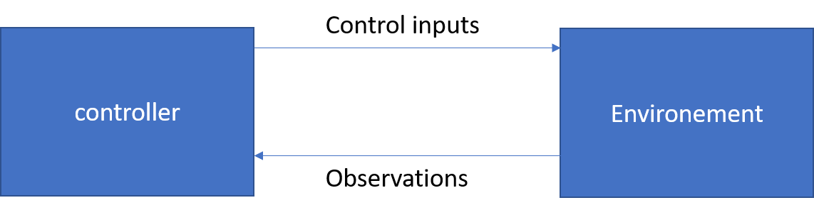

# General

Energym is a calibrated open source building simulation library designed for the control community to test climate control and energy management strategies on buildings in a systematic and reproducible way. Energym includes a number of building models that are calibrated on site data and defines standard metrics, quantifying the objective to be reached and allowing a standardized comparison between different controllers and publications.

The  library offers an intuitive interface to a variety of building models, similar to the one popularized by the [Gym library](https://gym.openai.com/)
 used in the robotic control community. Energym relies on the [functional mockup interface (FMI)](https://fmi-standard.org/) standard in order to support models generated in multiple modelling languages easily. It currently includes seven models developed in [Modelica](https://www.modelica.org/) and [EnergyPlus](https://energyplus.net/)  as well as specific classes for simulating weather forecasts and appliances consumption figures.

With the models already incorporated, Energym offers the possibility to benchmark controllers on buildings models that are representative of real-world HVAC systems. They cover different buildings typologies (institutional building, office building, etc.) and configuration of the HVAC where control can be performed at different levels (control of energy generation, control of final demand through setpoints, etc.). In summary, the models already incorporated are representative of cases that can be encountered in real-world control deployment.


## Documentation

The full documentation (with installation instructions, usage examples, buildings characteristics) is available at [Energym](https://csem.ch.gitlab.io/energym/)


## Working principles

Energym is a toolkit for developing and comparing control algorithms for buildings. It makes no assumptions about the structure of the control algorithms, whose implementation is left up to the user.

The Energym library includes a collection of test problems — environments — that can be used to benchmark algorithms. An environement typically contains one building and all its equipment (heat pumps, chillers, batteries, Photovoltaic installation, etc), and defines the boundary conditions that affect the building, for example the weather patterns. The environments have a shared interface, allowing you to write general algorithms.

Energym allows to apply control inputs to the buildings subsystems, for example temperature setpoints, and to receive information about the current state of the building, including for example zone temperatures, power consumption, etc. The observation can be then used by the controller to adapt the control inputs.



## System requirements

Precompiled FMU files are made available to the user, for both Windows 10 and Linux platforms. The linux files have been tested on Ubuntu 18.04, 20.04 and CentOS 7.

## Getting Started

The library runs with EnergyPlus and Modelica. To ensure that FMU models compiled from EnergyPlus models work, please install the following version of EnergyPlus:

- EnergyPlus 9.4 [link](https://energyplus.net/downloads)

Communication between the Python code and the FMU's relies on the package [FMPy](https://github.com/CATIA-Systems/FMPy), which is installed with the default installation.

### Install with pip

Firstly `git clone` the present repository and move inside with `cd energym`. Then run `pip install -e .`.

### Docker version

For users willing to use containers, a dockerfile, called `Dockerfile`, is made available. It creates an Ubuntu 20.04 container, with EnergyPlus and Python 3.8. This docker file is not made to compile .idf or .mo files  and works with the precompiled FMU's. For this latter particular task, two other dockers are proposed; see "Participating" below. Instructions to use the containers and install docker on windows are given in the docs.


## Available environments

Following environments are available:

Environment | Thermostat | Heat Pump | Battery | AHU | EV | PV | Software
---|---|---|---|---|---|---|---
`SmartlabThermal-v0` | :heavy_check_mark: | :heavy_check_mark: | :heavy_check_mark: | :x: | :heavy_check_mark: | :large_orange_diamond: | E+
`SmartlabGrid-v0` | :heavy_check_mark: | :large_orange_diamond: | :heavy_check_mark: | :x: | :heavy_check_mark: | :large_orange_diamond: | E+
`SeilabThermal-v0` | :heavy_check_mark: | :heavy_check_mark: | :heavy_check_mark: | :x: | :heavy_check_mark: | :large_orange_diamond: | E+
`SeilabGrid-v0` | :heavy_check_mark: | :large_orange_diamond: | :heavy_check_mark: | :x: | :heavy_check_mark: | :large_orange_diamond: | E+
`DatacenterThermostat-v0` | :heavy_check_mark: | :x: | :x: | :large_orange_diamond: | :x: | :x: | E+
`DatacenterTempFan-v0` | :heavy_check_mark: | :x: | :x: | :heavy_check_mark: | :x: | :x: | E+
`OfficesThermostat-v0` | :heavy_check_mark: | :x: | :x: | :x: | :x: | :large_orange_diamond: | E+
`SiloFanFCU-v0` | :heavy_check_mark: | :x: | :x: | :heavy_check_mark: | :x: | :x: | E+
`SeminarcenterThermostat-v0` | :heavy_check_mark: | :large_orange_diamond: | :x: | :x: | :x: | :large_orange_diamond: | E+
`SeminarcenterFull-v0` | :heavy_check_mark: | :heavy_check_mark: | :x: | :x: | :x: | :large_orange_diamond: | E+
`SimpleHouseRad-v0` | :x: | :heavy_check_mark: | :x: | :x: | :x: | :large_orange_diamond: | Mod
`SimpleHouseSlab-v0` | :x: | :heavy_check_mark: | :x: | :x: | :x: | :large_orange_diamond: | Mod
`SwissHouseRad-v0` | :x: | :heavy_check_mark: | :x: | :x: | :x: | :large_orange_diamond: | Mod

:heavy_check_mark: : present and controllable, :large_orange_diamond: : present but not controllable, :x: : absent. 

Control variables are outlined in yaml files for all environments in the simulation folder. Environment simulations are packed into FMU's for windows and debian distributions.


## Use the interface

An examplatory usage of Energym (assuming a function `get_input()` for computing the controls) looks as follows

```python
import energym

envName = "DatacenterThermostat-v0"
nsteps = 10
env = energym.make(envName, simulation_days=100)
obs = env.get_output()
for _ in range(nsteps):
    inputs = get_input(obs)
    obs = env.step(inputs)
env.close()
```


## Run an example

Examples of using the models can be found [here](notebooks)

## Input/Output reference for E+ models

Every FMU generated by an E+ model specifies certain inputs and outputs. Their format is defined as
`zone_type(_device(_sp(_out)))`

The different parts of the naming convention refer to:
- `zone`: Specifies the measured location, e.g. building zones (`Z01`, ..., `Z99`), the whole building `Bd` or the exterior `Ext`.
- `type`: Specifies the measured unit, e.g. the temperature `T`, the relative humidity `RH`, the power demand `Pw`, the energy consumption or production `E` or the flow rate `Fl`.
- `device` (optional): Specifies the measured object, e.g. a thermostat `Thermostat`, a heat pump `HP`, a HVAC unit `HVAC`, a solar panel `PV` or the combination of all energy consuming devices `All`.
- `sp` (optional): Specifies that the given value is used as a setpoint.
- `out` (optional): Specifies that a given setpoint is output.

Solar panels are the only devices in these buildings that produce energy.

Examples:
- `Z01_Pw_HVAC`
- `Ext_T`
- `Z99_T_Thermostat_sp_out`

For every environment, a list of inputs, outputs and weather files used is specified in the `energym/envs` folder for every building project.


## Contributing new models
This open-source library is featured to become the reference library for building control benchmarking. Users are encouraged to upload any new environment that present an interest for building control.

### On Windows
Please, download the latest version of EnergyPlus as well as a C/C++ compiler (for e.g., microsoft visual studio build tools). On windows, change the default compiler address in the .bat files in EnergyPlusToFMU/Scripts/win to your current C compiler address.
To create a new model, please create a new folder in `simulation/energyplus` or `simulation/modelica`. The folder must have following structure:
- `fmus`: where FMU's will be stored
- `src`: with `.idf` or `.mo` files: reference files to build the FMU's on any platform
- `wf`: weather files to be used for training and benchmarking evaluation

The `energym/envs` folder contains the specifics of the model: inputs, outputs as well as weather files for benchmarking and benchmarking metrics KPI's on the output

Once those steps have been carried out, run the script `script/create_eplus_env.py` to build EnergyPlus FMU's or `scripts/create_mo_env.py` to build Modelica FMU's (ensure before that you have JModelica installed and running under Python 2.7). We provide a .zip file with the latest public JModelica version. Please, install this JModelica version on your machine. Detail installation steps are given in the docs. We intend to move to OpenModelica as soon as all features of the Modelica buildings library will be supported by OpenModelica.

### Docker files (runs on linux machines or windows machines with WSL2)
We provide two dockerfiles with EnergyPlus and the latest open-source JModelica version. Be aware that JModelica compiler is not open-source anymore, and hence, we intend to switch asap to OpenModelica. One container runs with Python 2.7. The other is a hack of the python source files for both EnergyPlusToFMU and pymodelica, and runs in Python 3.8.
