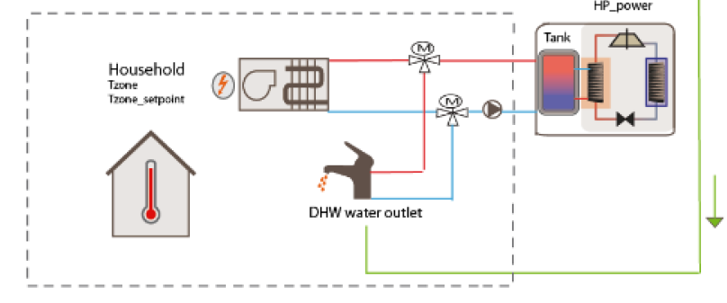

.. _Apartments2Thermal:

Apartments2Thermal
--------------------

Apartments2 Thermal is a 8 zones building located in Spain, Tarragona.  It has a total surface area of 417.12m\ :sup:`2` and a total volume of 1042.83m\ :sup:`3`.

Building and thermal zones
^^^^^^^^^^^^^^^^^^^^^^^^^^^^

.. image:: images/smartlab_seilab.PNG

.. image:: images/smartlab_seilab_zones.PNG

Thermal systems
^^^^^^^^^^^^^^^^^^^^^^^^^^^^

Apartments2 thermal system consists in four air-to-water heat pumps with integrated water tanks.
Each apartment has an individual HVAC system to provide hot water for fan coils heating coils and DHW consumption. 
Due to system configuration, it is not possible to control (change over time) the HP supply temperature neither storage tanks temperature.
This is because DHW consumption profiles have been evaluated taking into account a fixed DHW consumption temperature (50°C).

Electrical systems
^^^^^^^^^^^^^^^^^^^^^^^^^^^^

Regarding the electrical part, Apartments2 system includes a PV array, a community battery and two EV.
The first EV is assigned to the second apartment while the second one to the third apartment. 
In the thermal scenario, community battery and electric vehicles charging are disregarded; see :ref:`Apartments2grid`.

Controllable components
^^^^^^^^^^^^^^^^^^^^^^^^^^^^

Fan coil control
""""""""""""""""""
In order to control rooms temperature there is a single set point for each apartment. 
Set point (thermostat) temperatures of the thermal zones are compared with the actual temperatures sensed with the Energy Management System (EMS) sensors of EnergyPlus.
A temperature hysteresis control with a dead band of 0.51°C is implemented with an internal program. 
The heat provided by the fan coils is directly managed with the EMS actuator Fan Coil Air Mass Flow Rate to mimic an on-off two-stage control. 
In addition, in order to communicate with the HP, fan coils launch a binary signal each time step, one if heating is needed in the zone or zero for the contrary case.

Heat pump control 
""""""""""""""""""""
The user has the possibility to control the on/off mode of the four individual pumps. 

No active cooling system is implemented, a free cooling strategy is applied during summer season. This strategy is modelled with an enhanced air infiltration rate from June to September. 
Summer season in Spain can reach high temperature such as 35°C. This strategy allows maintaining rooms’ temperature into an acceptable range.

Simulation inputs
^^^^^^^^^^^^^^^^^^^^^^^^^^^^

For more detail, please check the documentation :ref:`apartments2_doc` or the source code :py:class:`energym.envs.apartments2.apartments2.Apartments2`.

.. exec::
    import json
    from energym.envs.apartments2.apartments2 import INPUTS_SPECS
    inputs_list = ["P1_T_Thermostat_sp",
    "P2_T_Thermostat_sp",
    "P3_T_Thermostat_sp",
    "P4_T_Thermostat_sp",
    "P1_onoff_HP_sp",
    "P2_onoff_HP_sp",
    "P3_onoff_HP_sp",
    "P4_onoff_HP_sp",
    "Bd_Ch_EV1Bat_sp",
    "Bd_Ch_EV2Bat_sp"]
    table = ".. csv-table:: \n    :header: Variable Name, Type, Lower Bound, Upper Bound, # States\n\n"
    for var in inputs_list:
        table = table + "    " + var + ", " + "" + INPUTS_SPECS[var]["type"] + ", "
        if INPUTS_SPECS[var]["type"] == "scalar":
            table = table + str(INPUTS_SPECS[var]["lower_bound"]) + ", " + str(INPUTS_SPECS[var]["upper_bound"]) + ", "
        else:
            table = table + ", , " + str(INPUTS_SPECS[var]["size"])
        table = table + "\n"
    print(table)
        

Simulation outputs
^^^^^^^^^^^^^^^^^^^^^^^^^^^^
.. exec::
    import json
    from energym.envs.apartments2.apartments2 import OUTPUTS_SPECS
    outputs_list = ["Ext_T",
    "Ext_RH",
    "Ext_Irr",
    "Ext_P",
    "P3_T_Thermostat_sp_out",
    "P4_T_Thermostat_sp_out",
    "P2_T_Thermostat_sp_out",
    "P1_T_Thermostat_sp_out",
    "Bd_Pw_Bat_sp_out",
    "Bd_Ch_EV1Bat_sp_out",
    "Bd_Ch_EV2Bat_sp_out",
    "Bd_DisCh_EV1Bat",
    "Bd_DisCh_EV2Bat",
    "Bd_Frac_Vent_sp_out",
    "Z01_E_Appl",
    "Z02_E_Appl",
    "Z03_E_Appl",
    "Z04_E_Appl",
    "Z05_E_Appl",
    "Z06_E_Appl",
    "Z07_E_Appl",
    "Z08_E_Appl",
    "P1_FlFrac_HW",
    "P2_FlFrac_HW",
    "P3_FlFrac_HW",
    "P4_FlFrac_HW",
    "Z01_T",
    "Z01_RH",
    "Z02_T",
    "Z02_RH",
    "Z03_T",
    "Z03_RH",
    "Z04_T",
    "Z04_RH",
    "Z05_T",
    "Z05_RH",
    "Z06_T",
    "Z06_RH",
    "Z07_T",
    "Z07_RH",
    "Z08_T",
    "Z08_RH",
    "Fa_Stat_EV1",
    "Fa_ECh_EV1Bat",
    "Fa_EDCh_EV1Bat",
    "Fa_Stat_EV2",
    "Fa_ECh_EV2Bat",
    "Fa_EDCh_EV2Bat",
    "Fa_ECh_Bat",
    "Fa_EDCh_Bat",
    "Bd_FracCh_EV1Bat",
    "Bd_FracCh_EV2Bat",
    "Bd_FracCh_Bat",
    "P4_T_Tank",
    "P2_T_Tank",
    "P1_T_Tank",
    "P3_T_Tank",
    "P1_onoff_HP_sp_out",
    "P2_onoff_HP_sp_out",
    "P3_onoff_HP_sp_out",
    "P4_onoff_HP_sp_out",
    "Fa_Pw_All",
    "Fa_Pw_Prod",
    "Fa_E_self",
    "Fa_Pw_HVAC",
    "Fa_E_All",
    "Fa_E_Light",
    "Fa_E_Appl"]
    table = ".. csv-table:: \n    :header: Variable Name, Type, Lower Bound, Upper Bound, # States\n\n"
    for var in outputs_list:
        table = table + "    " + var + ", " + "" + OUTPUTS_SPECS[var]["type"] + ", "
        if OUTPUTS_SPECS[var]["type"] == "scalar":
            table = table + str(OUTPUTS_SPECS[var]["lower_bound"]) + ", " + str(OUTPUTS_SPECS[var]["upper_bound"]) + ", "
        else:
            table = table + ", , " + str(OUTPUTS_SPECS[var]["size"])
        table = table + "\n"
    print(table)

Evaluation scenario
^^^^^^^^^^^^^^^^^^^^^^^^^^^^

The evaluation scenario for the `Apartments2Thermal-v0` model consists of a control from January to April with the objective of minimizing the grid exchange, while keeping the zone temperatures between 19 and 24°C.
For this goal, the tracked KPIs are the average exchanged energy (absolute value of the difference of produced and consumed energy), and the average temperature deviation and total temperature violations with respect to the interval [19, 24].

Notebook example
^^^^^^^^^^^^^^^^^^^^^^^^^^^^
.. toctree::
   :maxdepth: 1
   :caption:  Here is a notebook example:

   notebooks/Apartments2Thermal