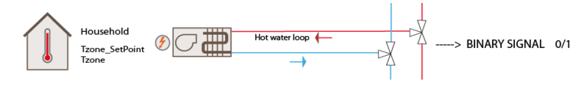
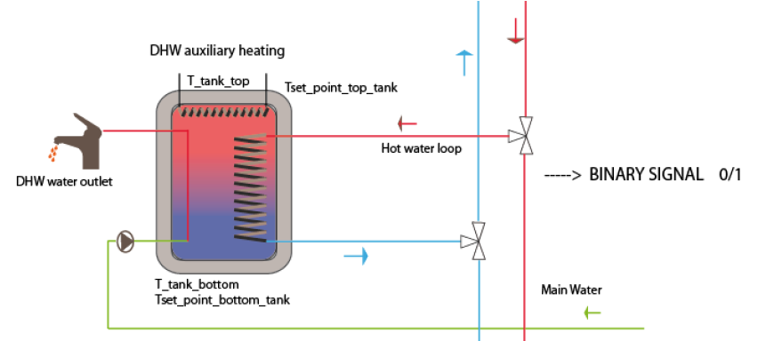
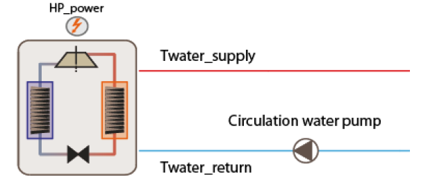

.. _ApartmentsThermal:

ApartmentsThermal
--------------------

.. image:: images/irec_picture.PNG

ApartmentsThermal is a 8 zones building located in Spain, Tarragona.  It has a total surface area of 417.12m\ :sup:`2` and a total volume of 1042.83m\ :sup:`3`. 

Building and thermal zones
^^^^^^^^^^^^^^^^^^^^^^^^^^^^

.. image:: images/smartlab_seilab.PNG

.. image:: images/smartlab_seilab_zones.PNG

Thermal systems
^^^^^^^^^^^^^^^^^^^^^^^^^^^^

Apartments thermal system consists of a centralized water-to-water geothermal heat pump (HP) system, which extracts heat from the ground through a vertical ground heat exchanger,
and provides hot water for the indoor fan coil units (two units per apartment) and the Domestic Hot Water (DHW). The DHW system is composed by four storage systems,
one for each household, and consist in a four node-stratified tank. Heating loop circuit from the heat pump is connected to the bottom half part of the tanks and electrical
heaters are placed on the top part acting as auxiliary systems.

Electrical systems
^^^^^^^^^^^^^^^^^^^^^^^^^^^^

Regarding the electrical part, Apartments system includes a PV array, a community battery and an electric vehicle (EV). 
In the thermal scenario, community battery and electric vehicle charging are disregarded; see :ref:`Apartmentsgrid`.

Controllable components
^^^^^^^^^^^^^^^^^^^^^^^^^^^^

Fan coil control
""""""""""""""""""
In order to control rooms temperature there is a single set point for each apartment. 

Set point (thermostat) temperatures of the thermal zones are compared with the actual temperatures sensed with the Energy Management System (EMS) sensors of EnergyPlus.
A temperature hysteresis control with a dead band of 0.51°C is implemented with an internal program. 
The heat provided by the fan coils is directly managed with the EMS actuator Fan Coil Air Mass Flow Rate to mimic an on-off two-stage control. 
In addition, in order to communicate with the HP, fan coils launch a binary signal each time step, one if heating is needed in the zone or zero for the contrary case.

Storage tank control 
""""""""""""""""""""
Storage tanks present two thermostats, one in the top part (Node 1) and the other in the middle bottom part (Node 3). Only node 3 is controlled by the user.

Node 1 temperature is controlled by an electrical heater and by a hysteresis control with a dead band of 2°C. 
On the other hand, the bottom part is connected with the HP loop and is controlled by a hysteresis control with a dead band of 5°C. 
As for the fan coils, storage tanks launch a binary signal to the HP based on the bottom part control.

Heat pump control 
""""""""""""""""""""
The user has the possibility to control the water supply temperature of the pump and the on/off mode of the pump. 

No active cooling system is implemented, a free cooling strategy is applied during summer season. This strategy is modelled with an enhanced air infiltration rate from June to September. 
Summer season in Spain can reach high temperature such as 35°C. This strategy allows maintaining rooms’ temperature into an acceptable range.

Simulation inputs
^^^^^^^^^^^^^^^^^^^^^^^^^^^^

For more detail, please check the documentation :ref:`apartments_doc` or the source code :py:class:`energym.envs.apartments.apartments.Apartments`.

.. exec::
    import json
    from energym.envs.apartments.apartments import INPUTS_SPECS
    inputs_list = ["P1_T_Thermostat_sp",
    "P2_T_Thermostat_sp",
    "P3_T_Thermostat_sp",
    "P4_T_Thermostat_sp",
    "Bd_T_HP_sp",
    "P1_T_Tank_sp",
    "P2_T_Tank_sp",
    "P3_T_Tank_sp",
    "P4_T_Tank_sp",
    "HVAC_onoff_HP_sp",
    "Bd_Pw_Bat_sp",
    "Bd_Ch_EVBat_sp"]
    table = ".. csv-table:: \n    :header: Variable Name, Type, Lower Bound, Upper Bound, # States\n\n"
    for var in inputs_list:
        table = table + "    " + var + ", " + "" + INPUTS_SPECS[var]["type"] + ", "
        if INPUTS_SPECS[var]["type"] == "scalar":
            table = table + str(INPUTS_SPECS[var]["lower_bound"]) + ", " + str(INPUTS_SPECS[var]["upper_bound"]) + ", "
        else:
            table = table + ", , " + str(INPUTS_SPECS[var]["size"])
        table = table + "\n"
    print(table)
        

Simulation outputs
^^^^^^^^^^^^^^^^^^^^^^^^^^^^
.. exec::
    import json
    from energym.envs.apartments.apartments import OUTPUTS_SPECS
    outputs_list = ["Ext_T",
    "Ext_RH",
    "Ext_Irr",
    "Ext_P",
    "P3_T_Thermostat_sp_out",
    "P4_T_Thermostat_sp_out",
    "P2_T_Thermostat_sp_out",
    "P1_T_Thermostat_sp_out",
    "Bd_T_HP_sp_out",
    "P1_T_Tank_sp_out",
    "P2_T_Tank_sp_out",
    "P3_T_Tank_sp_out",
    "P4_T_Tank_sp_out",
    "Bd_Pw_Bat_sp_out",
    "Bd_Ch_EVBat_sp_out",
    "Bd_DisCh_EVBat",
    "Bd_Frac_Vent_sp_out",
    "Z01_E_Appl",
    "Z02_E_Appl",
    "Z03_E_Appl",
    "Z04_E_Appl",
    "Z05_E_Appl",
    "Z06_E_Appl",
    "Z07_E_Appl",
    "Z08_E_Appl",
    "P1_FlFrac_HW",
    "P2_FlFrac_HW",
    "P3_FlFrac_HW",
    "P4_FlFrac_HW",
    "Z01_T",
    "Z01_RH",
    "Z02_T",
    "Z02_RH",
    "Z03_T",
    "Z03_RH",
    "Z04_T",
    "Z04_RH",
    "Z05_T",
    "Z05_RH",
    "Z06_T",
    "Z06_RH",
    "Z07_T",
    "Z07_RH",
    "Z08_T",
    "Z08_RH",
    "Fa_Stat_EV",
    "Fa_ECh_EVBat",
    "Fa_EDCh_EVBat",
    "Fa_ECh_Bat",
    "Fa_EDCh_Bat",
    "Bd_FracCh_EVBat",
    "Bd_FracCh_Bat",
    "P4_T_Tank",
    "P2_T_Tank",
    "P1_T_Tank",
    "P3_T_Tank",
    "HVAC_Pw_HP",
    "HVAC_onoff_HP_sp_out",
    "Bd_E_HW",
    "Fa_Pw_All",
    "Fa_Pw_Prod",
    "Fa_E_self",
    "Fa_Pw_HVAC",
    "Fa_E_All",
    "Fa_E_Light",
    "Fa_E_Appl"]
    table = ".. csv-table:: \n    :header: Variable Name, Type, Lower Bound, Upper Bound, # States\n\n"
    for var in outputs_list:
        table = table + "    " + var + ", " + "" + OUTPUTS_SPECS[var]["type"] + ", "
        if OUTPUTS_SPECS[var]["type"] == "scalar":
            table = table + str(OUTPUTS_SPECS[var]["lower_bound"]) + ", " + str(OUTPUTS_SPECS[var]["upper_bound"]) + ", "
        else:
            table = table + ", , " + str(OUTPUTS_SPECS[var]["size"])
        table = table + "\n"
    print(table)

Evaluation scenario
^^^^^^^^^^^^^^^^^^^^^^^^^^^^

The evaluation scenario for the `ApartmentsThermal-v0` model consists of a control from January to April with the objective of minimizing the grid exchange, while keeping the zone temperatures between 19 and 24°C.
For this goal, the tracked KPIs are the average exchanged energy (absolute value of the difference of produced and consumed energy), and the average temperature deviation and total temperature violations with respect to the interval [19, 24].

Notebook example
^^^^^^^^^^^^^^^^^^^^^^^^^^^^
.. toctree::
   :maxdepth: 1
   :caption:  Here is a notebook example:

   notebooks/ApartmentsThermal