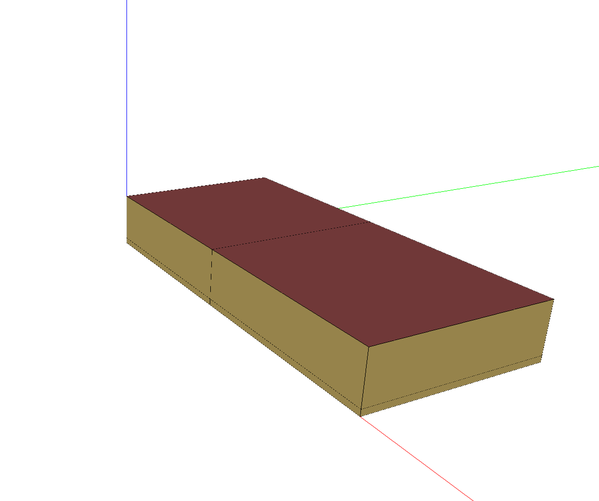
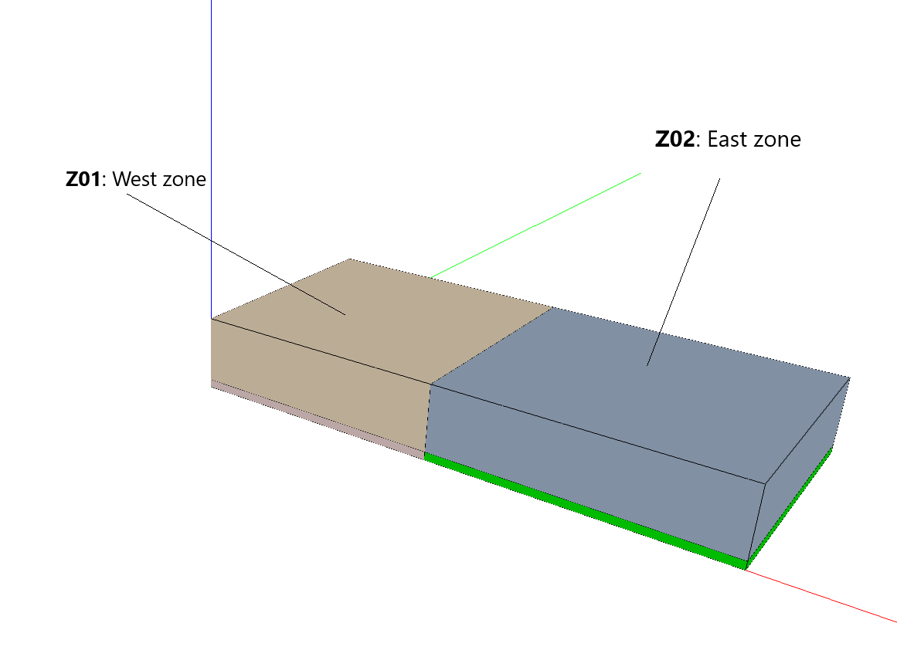

.. _DataCenterFull:

DataCenterFull
----------------

The datacenter is a basic 491.34m\ :sup:`2` building with no windows located in USA, Chicago. It includes only two rooms with two independent AHU units.

Building and thermal zones
^^^^^^^^^^^^^^^^^^^^^^^^^^^^

The buildings comports two thermal and air cooled zones.

Thermal systems
^^^^^^^^^^^^^^^^^^^^^^^^^^^^
Each zone is served by its own HVAC airloop.  Each air loop has a DX cooling coil and a chilled water cooling coil.

Electrical systems
^^^^^^^^^^^^^^^^^^^^^^^^^^^^
Computing loads are modeled with ITE and air cooled equipments

Controllable components
^^^^^^^^^^^^^^^^^^^^^^^^^^^^

AHU  control
"""""""""""""""""""""
The user can control both the air flow and the air temperature of each AHU.

Fan coil control
""""""""""""""""""
The room temperature setpoints can be controlled. No hysteresis low level control loop is implemented, and the temperature follows the setpoints in an ideal way.

Simulation inputs
^^^^^^^^^^^^^^^^^^^^^^^^^^^^

For more detail, please check the documentation :ref:`datacenter_doc` or the source code :py:class:`energym.envs.datacenter.datacenter.DataCenter`.

.. exec::
    import json
    from energym.envs.datacenter.datacenter import INPUTS_SPECS
    inputs_list = ["Z01_T_HVAC_sp", "Z02_T_HVAC_sp", "Z02_Fl_Fan_sp", "Z01_Fl_Fan_sp"]
    table = ".. csv-table:: \n    :header: Variable Name, Type, Lower Bound, Upper Bound, # States\n\n"
    for var in inputs_list:
        table = table + "    " + var + ", " + "" + INPUTS_SPECS[var]["type"] + ", "
        if INPUTS_SPECS[var]["type"] == "scalar":
            table = table + str(INPUTS_SPECS[var]["lower_bound"]) + ", " + str(INPUTS_SPECS[var]["upper_bound"]) + ", "
        else:
            table = table + ", , " + str(INPUTS_SPECS[var]["size"])
        table = table + "\n"
    print(table) 

Simulation outputs
^^^^^^^^^^^^^^^^^^^^^^^^^^^^

.. exec::
    import json
    from energym.envs.datacenter.datacenter import OUTPUTS_SPECS
    outputs_list = ["Bd_Pw_All", "Bd_Load_CPU", "Ext_Irr", "Ext_RH", "Ext_T", "Fa_Pw_All", "Fa_Pw_HVAC", "Z01_Fl_Fan",
    "Z01_Fl_Fan_sp_out",
    "Z01_EEn_CCDX",
    "Z01_EEn_DEC",
    "Z01_EEn_Fan",
    "Z01_EEn_IEC",
    "Z01_RH",
    "Z01_T",
    "Z01_T_HVAC_sp_out",
    "Z01_T_MixAir",
    "Z02_Fl_Fan",
    "Z02_Fl_Fan_sp_out",
    "Z02_EEn_CCDX",
    "Z02_EEn_DEC",
    "Z02_EEn_Fan",
    "Z02_EEn_IEC",
    "Z02_RH",
    "Z02_T",
    "Z02_T_HVAC_sp_out",
    "Z02_T_MixAir"]
    table = ".. csv-table:: \n    :header: Variable Name, Type, Lower Bound, Upper Bound, # States\n\n"
    for var in outputs_list:
        table = table + "    " + var + ", " + "" + OUTPUTS_SPECS[var]["type"] + ", "
        if OUTPUTS_SPECS[var]["type"] == "scalar":
            table = table + str(OUTPUTS_SPECS[var]["lower_bound"]) + ", " + str(OUTPUTS_SPECS[var]["upper_bound"]) + ", "
        else:
            table = table + ", , " + str(OUTPUTS_SPECS[var]["size"])
        table = table + "\n"
    print(table)

Evaluation scenario
^^^^^^^^^^^^^^^^^^^^^^^^^^^^

The evaluation scenario for the `DatacenterTempFan-v0` model consists of a full year control with the objective of minimizing the power demand, while keeping the zone temperatures between 17 and 26°C.
For this goal, the tracked KPIs are the average power demand on the facility level, and the average temperature deviation and total temperature violations with respect to the interval [17, 26].

Notebook example
^^^^^^^^^^^^^^^^^^^^^^^^^^^^
.. toctree::
   :maxdepth: 1
   :caption:  Here is a notebook example:

   notebooks/DataCenterTempFan