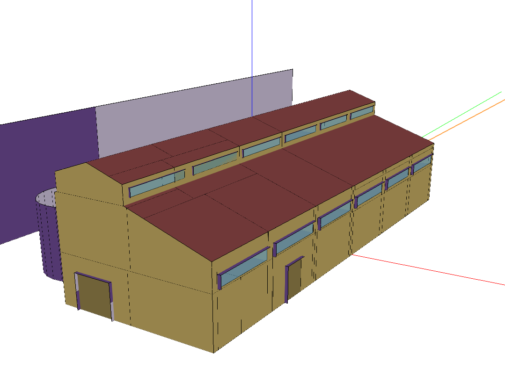
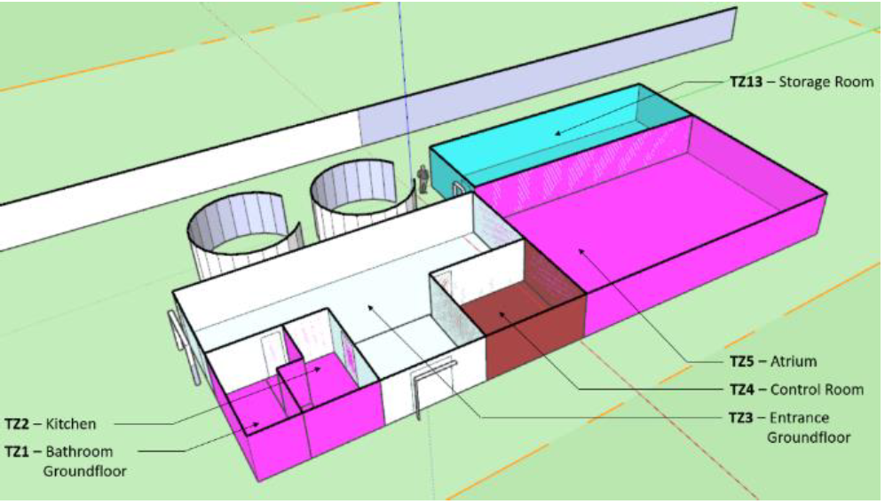
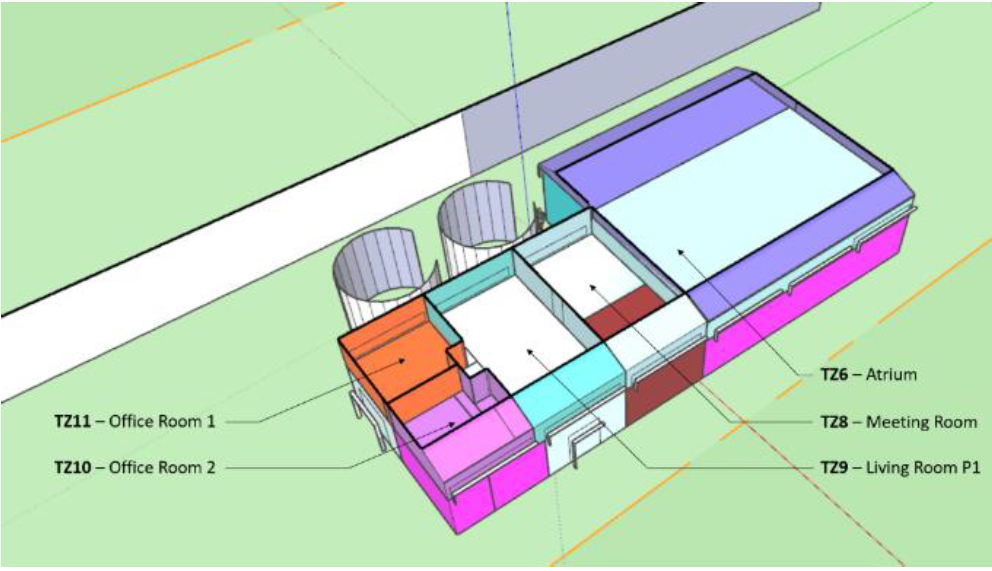
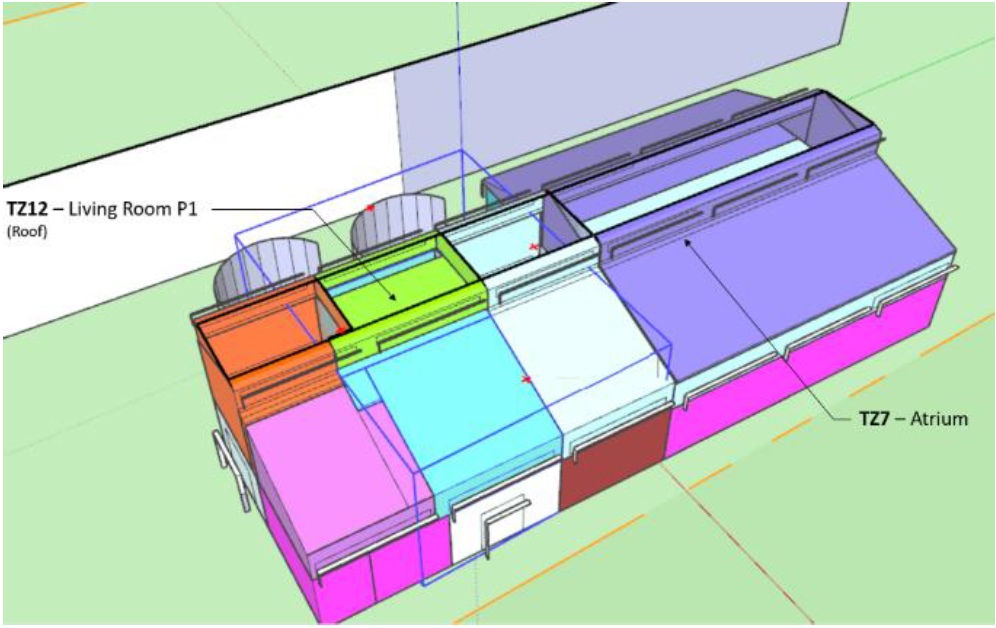
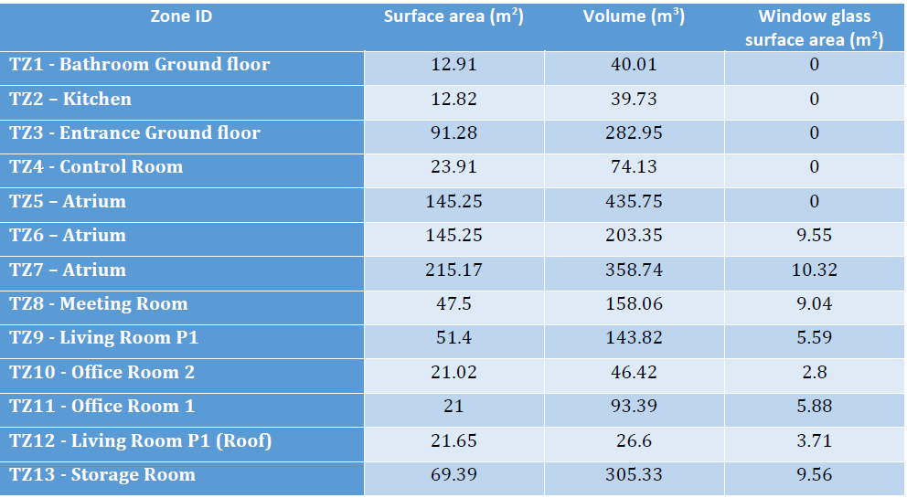

.. _MixedUse:

MixedUse
----------------

The MixedUse building is located in Greece. It is situated at an altitude of 10 meters over sea level, and has a total surface area of 566.38m\ :sup:`2` and a total air volume of 2208.27m\ :sup:`3`.

Building and thermal zones
^^^^^^^^^^^^^^^^^^^^^^^^^^^^

Thermal systems
^^^^^^^^^^^^^^^^^^^^^^^^^^^^
The HVAC system installed for the MixedUse building consists of two Air Handling Units (AHU), one dedicated exclusively to thermal zones 5, 6 and 7 and a second one serving to the remaining thermal zones.
Both devices work in conjunction with variable refrigerant volume indoor units to air-condition interior spaces.

The first AHU system dedicated to TZ-5, 6 and 7  is composed of an air loop, an AHU that includes water coils and two supply water loops; one with a Heat Pump Water Heater (HPWH) and the other with a chiller.
The second AHU system serving the entire facility consists of an air loop with an AHU that has direct expansion “DX” coils. 
In addition, the zones that are affected under this system have variable refrigerant flow (VRF) terminal units as part of the air-conditioning system.

Electrical systems
^^^^^^^^^^^^^^^^^^^^^^^^^^^^
The site incorporates a 48 kW photovoltaic installation.  The surface area of the PV panels is 475 m2.

Controllable components
^^^^^^^^^^^^^^^^^^^^^^^^^^^^

Fan coil control
""""""""""""""""""
The room temperature setpoints can be controlled. A low-level hysteresis control loop is implemented to ensure that the room temperature stays close to the setpoints.

AHU control
""""""""""""""""""
Both AHUs, the one for the zones 5,6,7, (called AHU1) and the one for the rest of the building (called AHU2) can be controlled. 
Control variables for AHU1 are the air flow rate of the ventilation system,  and the setpoint temperature of the heated or cooled water (air to water heatpump water setpoint, or chilled water setpoint). 
Control variables for AHU2 are the air flow rate of the ventilation system,  and the setpoint temperature of air flow. 

Simulation inputs
^^^^^^^^^^^^^^^^^^^^^^^^^^^^

For more detail, please check the documentation :ref:`mixeduse_doc` or the source code :py:class:`energym.envs.mixeduse.mixeduse.MixedUse`.

.. exec::
    import json
    from energym.envs.mixeduse.mixeduse import INPUTS_SPECS
    table = ".. csv-table:: \n    :header: Variable Name, Type, Lower Bound, Upper Bound, # States\n\n"
    for var in INPUTS_SPECS:
        table = table + "    " + var + ", " + "" + INPUTS_SPECS[var]["type"] + ", "
        if INPUTS_SPECS[var]["type"] == "scalar":
            table = table + str(INPUTS_SPECS[var]["lower_bound"]) + ", " + str(INPUTS_SPECS[var]["upper_bound"]) + ", "
        else:
            table = table + ", , " + str(INPUTS_SPECS[var]["size"])
        table = table + "\n"
    print(table)
        

Simulation outputs
^^^^^^^^^^^^^^^^^^^^^^^^^^^^

.. exec::
    import json
    from energym.envs.mixeduse.mixeduse import OUTPUTS_SPECS
    table = ".. csv-table:: \n    :header: Variable Name, Type, Lower Bound, Upper Bound, # States\n\n"
    for var in OUTPUTS_SPECS:
        table = table + "    " + var + ", " + "" + OUTPUTS_SPECS[var]["type"] + ", "
        if OUTPUTS_SPECS[var]["type"] == "scalar":
            table = table + str(OUTPUTS_SPECS[var]["lower_bound"]) + ", " + str(OUTPUTS_SPECS[var]["upper_bound"]) + ", "
        else:
            table = table + ", , " + str(OUTPUTS_SPECS[var]["size"])
        table = table + "\n"
    print(table)

Evaluation scenario
^^^^^^^^^^^^^^^^^^^^^^^^^^^^

The evaluation scenario for the `MixedUseFanFCU-v0` model consists of a full year control with the objective of minimizing the power demand, while keeping the zone temperatures between 19 and 24°C.
For this goal, the tracked KPIs are the average power demand on the facility level, and the average temperature deviation and total temperature violations with respect to the interval [19, 24].

Notebook example
^^^^^^^^^^^^^^^^^^^^^^^^^^^^
.. toctree::
   :maxdepth: 1
   :caption:  Here is a notebook example:

   notebooks/MixedUse