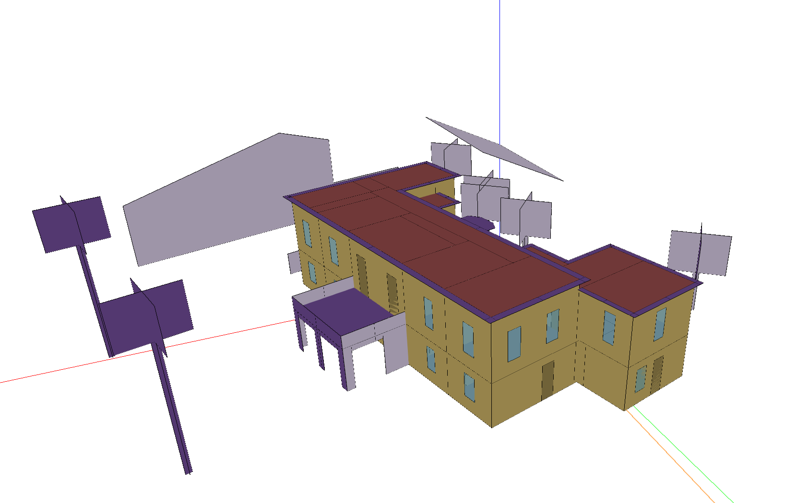
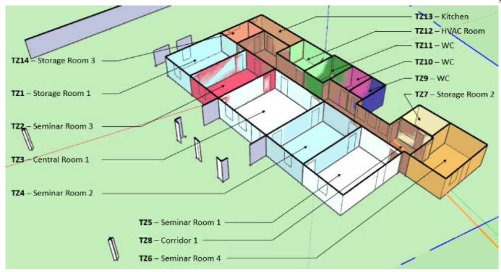
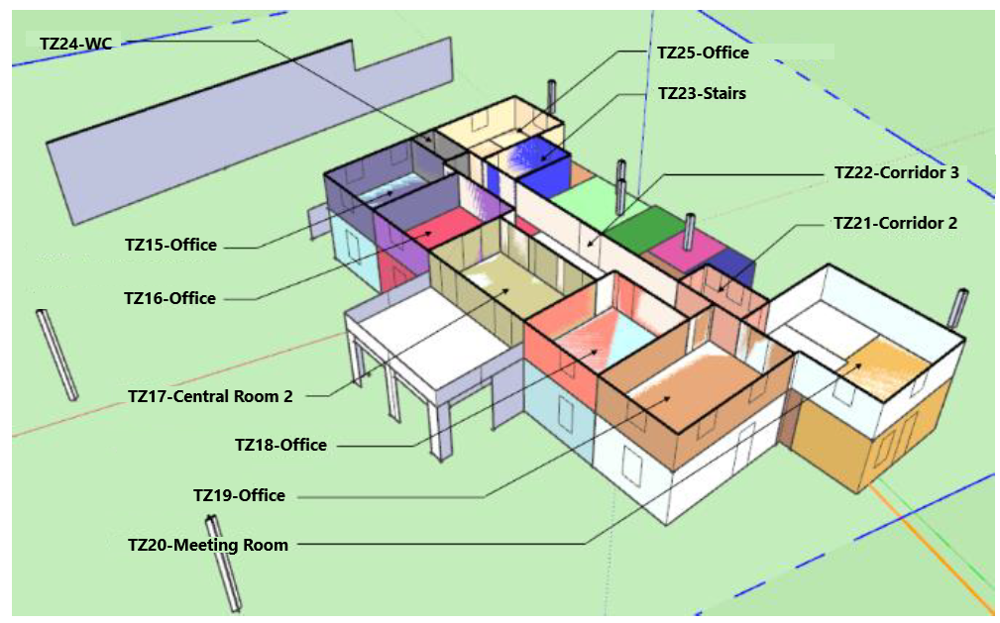
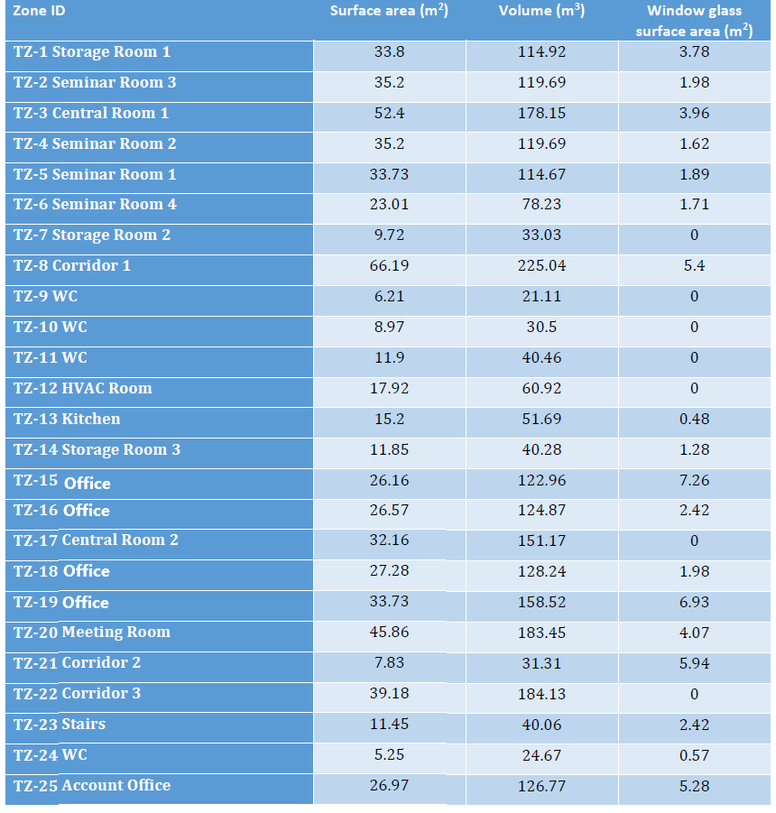

.. _Offices:

Offices
----------------

Offices building is located in Greece. It is situated at an altitude of 4 meters over sea level, and has a total surface area of 643.73m\ :sup:`2` and a total air volume of 2504.54m\ :sup:`3`.
It includes the following 25 conditioned rooms:

* 3 Storage Rooms.
* 4 Seminar Rooms.
* 2 Central Rooms (Lobbies).
* 3 Corridors.
* 1 Staircase
* 4 WC (Bathrooms).
* 1 Kitchen.
* 5 Office Spaces.
* 1 Meeting Room.
* 1 HVAC air handling equipment room. 

Building and thermal zones
^^^^^^^^^^^^^^^^^^^^^^^^^^^^

Thermal systems
^^^^^^^^^^^^^^^^^^^^^^^^^^^^
The systems installed consist of a series of water to air fan coil units, deployed in different conditioned spaces of the building. 
This test site does not include an Air Handling Unit (AHU) of any kind, or any other forced ventilation/air climatization system.
The installed fan coil units are supplied by a two-pipe water distribution system connected to a valve setup that can either send hot water from an oil boiler for heating demands,
or deliver chilled water from an electrical air to water chiller, but not both.

Electrical systems
^^^^^^^^^^^^^^^^^^^^^^^^^^^^
The site incorporates a 10 kW photovoltaic installation.  

Controllable components
^^^^^^^^^^^^^^^^^^^^^^^^^^^^

Fan coil control
""""""""""""""""""
The room temperature setpoints can be controlled. A low-level hysteresis control loop is implemented to ensure that the room temperature stays close to the setpoints.
Notice that not all thermal zones are controllable (corridors, WC, Stairs, HVAC Room, Storage rooms and Kitchen have no thermostat control)

Chiller/Boiler control
"""""""""""""""""""""""
The user can decide whether to heat up or cool down the building, by putting the boiler on/off and the chiller on/off.
It is forbiden to use both heating and cooling at the same time.

Simulation inputs
^^^^^^^^^^^^^^^^^^^^^^^^^^^^

For more detail, please check the documentation :ref:`offices_doc` or the source code in :py:class:`energym.envs.offices.offices.Offices`.

.. exec::
    import json
    from energym.envs.offices.offices import INPUTS_SPECS
    table = ".. csv-table:: \n    :header: Variable Name, Type, Lower Bound, Upper Bound, # States\n\n"
    for var in INPUTS_SPECS:
        table = table + "    " + var + ", " + "" + INPUTS_SPECS[var]["type"] + ", "
        if INPUTS_SPECS[var]["type"] == "scalar":
            table = table + str(INPUTS_SPECS[var]["lower_bound"]) + ", " + str(INPUTS_SPECS[var]["upper_bound"]) + ", "
        else:
            table = table + ", , " + str(INPUTS_SPECS[var]["size"])
        table = table + "\n"
    print(table)
        

Simulation outputs
^^^^^^^^^^^^^^^^^^^^^^^^^^^^

.. exec::
    import json
    from energym.envs.offices.offices import OUTPUTS_SPECS
    table = ".. csv-table:: \n    :header: Variable Name, Type, Lower Bound, Upper Bound, # States\n\n"
    for var in OUTPUTS_SPECS:
        table = table + "    " + var + ", " + "" + OUTPUTS_SPECS[var]["type"] + ", "
        if OUTPUTS_SPECS[var]["type"] == "scalar":
            table = table + str(OUTPUTS_SPECS[var]["lower_bound"]) + ", " + str(OUTPUTS_SPECS[var]["upper_bound"]) + ", "
        else:
            table = table + ", , " + str(OUTPUTS_SPECS[var]["size"])
        table = table + "\n"
    print(table)

Evaluation scenario
^^^^^^^^^^^^^^^^^^^^^^^^^^^^

The evaluation scenario for the `OfficesThermostat-v0` model consists of a full year control with the objective of minimizing the power demand, while keeping the zone temperatures between 19 and 24°C.
For this goal, the tracked KPIs are the average power demand on the facility level, and the average temperature deviation and total temperature violations with respect to the interval [19, 24].

Notebook example
^^^^^^^^^^^^^^^^^^^^^^^^^^^^
.. toctree::
   :maxdepth: 1
   :caption:  Here is a notebook example:

   notebooks/Offices