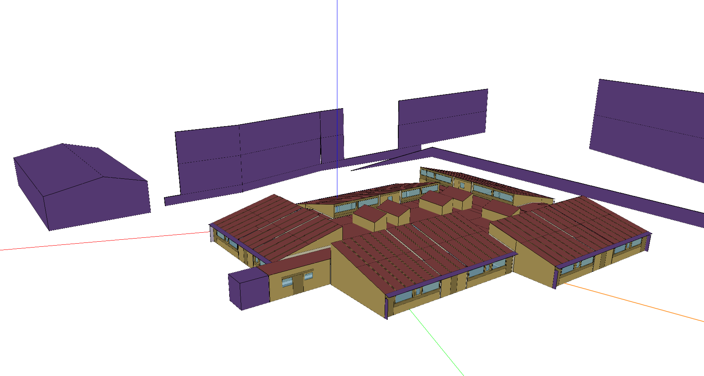
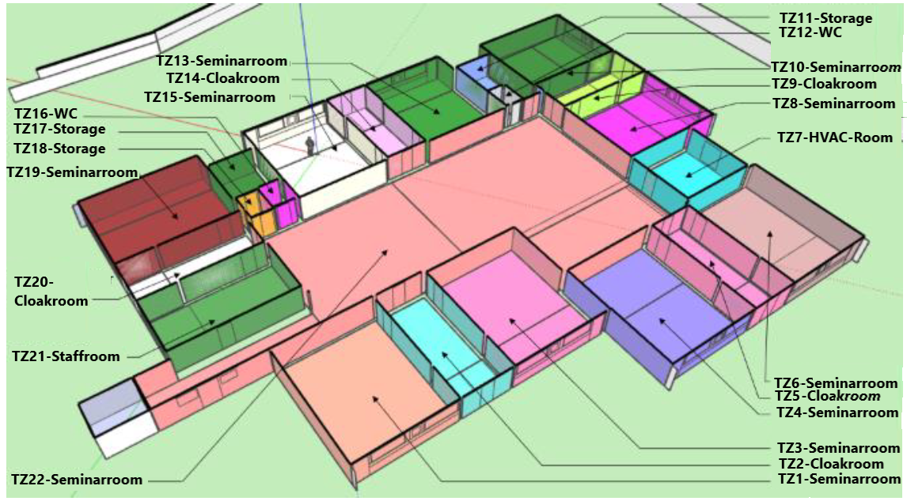
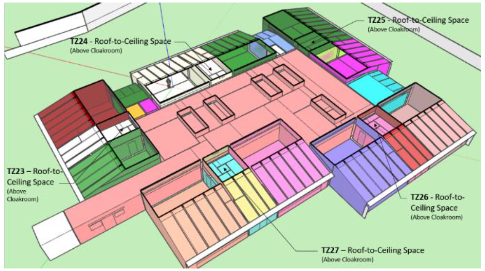
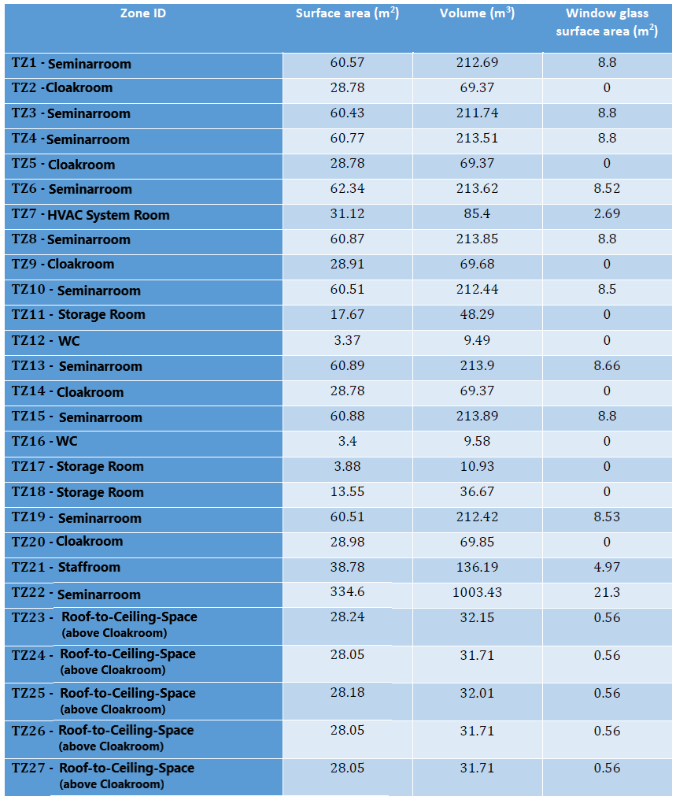
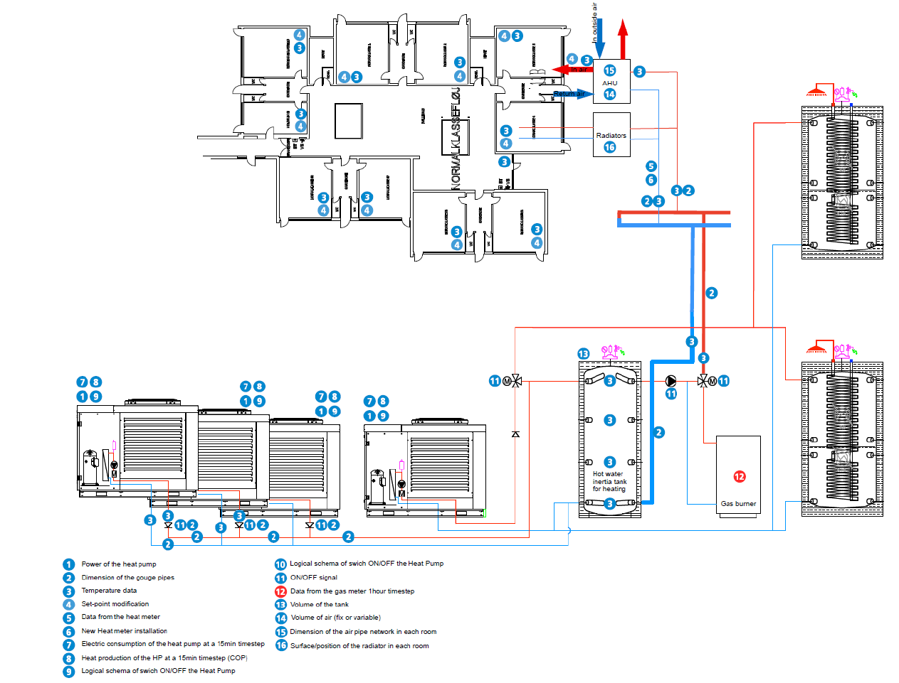

.. _SeminarcenterFull:

SeminarcenterFull
-------------------

Seminarcenter test site is located in Denmark. It is a one-story building situated at an altitude of 248 meters over sea level,
with a total surface area of 1278.94m\ :sup:`2` and a total air volume of 3764.95m\ :sup:`3`. It includes the following 22 conditioned rooms:

* 1 Large seminar room.
* 9 Small seminar rooms.
* 3 Storage rooms.
* 5 Cloakrooms.
* 1 Staffroom.
* 2 Bathrooms.
* 1 HVAC air handling equipment room.

And 5 additional unconditioned areas:

* 5 Roof-to-ceiling space above Cloakrooms.

Building and thermal zones
^^^^^^^^^^^^^^^^^^^^^^^^^^^^

Thermal systems
^^^^^^^^^^^^^^^^^^^^^^^^^^^^
The endpoint thermal distribution setup of Seminarcenter’s HVAC system consists of a series of water convectors deployed in different rooms
that operate cooperatively with an Air Handling Unit (AHU) to provide heating to the different spaces. There is no cooling in this building.

The HVAC supply system allows it to serve the combined demand for heating and domestic hot water on the building. Thus, the HVAC system is composed by six different circuits or loops, one air loop,
one domestic hot water loop, four heating water loops that supply heating for all the utilities, including the water convectors, 
and three heating water loops whose purpose is to supply the previous circuits with heating:

* The air loop handles the ventilation requirement and provides conditioned air to the thermal zones.
* The buffer tank water loop that delivers heating hot water to the seminar center, including the coil of the AHU and the water convectors installed to increase the space temperature.
* In this case there are two main hot water supply loops that provide heating to the buffer tank: one with the Heat Pump Water Heater (HPWH) Group and the other with a gas fired condensing boiler.
* Finally, the domestic hot water loop and the Heat Pump Water Heater – Unit 1 loop that supplies both the buffer tank and the domestic hot water with heating.

Air loop for ventilation
""""""""""""""""""""""""""
The AHU consists of two fan components, one water coil (heating), an air heat recovery system (Air to air Heat exchanger) and an outdoor air system (fresh air). 
The supply and extract fans are fixed as constant volume with a total efficiency of 0.7. The water coil is the demand side of the buffer tank water loop (heating). Finally, the outdoor air system provides outdoor air for ventilation. 
In this case, to increase the AHU efficiency, the system, as currently implemented, recirculates the air and recovers the heat from the exhaust air at a fixed efficiency of 0.75

Heating loop
""""""""""""""""""""
The integrated system is based on an air to water HP Thermal Group (heat pumps 1 to 4) that supplies heating to the buffer tank loop, and thus to the AHU and the water convectors in the building.
If the HP Group cannot handle the thermal zones heating demand during certain peak hours, the boiler loop acts as an auxiliary system to supply the required heating water into the system.

Electrical systems
^^^^^^^^^^^^^^^^^^^^^^^^^^^^
The site incorporates a 12 kW photovoltaic installation.

Controllable components
^^^^^^^^^^^^^^^^^^^^^^^^^^^^

Fan coil control
""""""""""""""""""
The room temperature setpoints can be controlled. On the contrary to other buildings in the large seminar room, and ideal room temperature control with thermostat is implemented (no hysteresis control).

Heat pump control 
""""""""""""""""""""
The user has the possibility to control the water supply temperature and the on/off mode of each individual pump.

AHU control
""""""""""""""""""""
The user has the possibility to control the AHU coil temperature and the AHU air temperature setpoints.

Buffer Tank control
""""""""""""""""""""
The user has the possibility to control the buffer tank temperature setpoint.

Simulation inputs
^^^^^^^^^^^^^^^^^^^^^^^^^^^^

For more detail, please check the documentation :ref:`seminarcenter_doc` or the source code :py:class:`energym.envs.seminarcenter.seminarcenter.Seminarcenter`.

.. exec::
    import json
    from energym.envs.seminarcenter.seminarcenter import INPUTS_SPECS
    inputs_list = ["Bd_onoff_HP1_sp",
    "Bd_onoff_HP2_sp",
    "Bd_onoff_HP3_sp",
    "Bd_onoff_HP4_sp",
    "Bd_T_HP1_sp",
    "Bd_T_HP2_sp",
    "Bd_T_HP3_sp",
    "Bd_T_HP4_sp",
    "Bd_T_AHU_coil_sp",
    "Bd_T_buffer_sp",
    "Bd_T_mixer_sp",
    "Bd_T_Boiler_sp",
    "Bd_T_HVAC_sp",
    "Z01_T_Thermostat_sp",
    "Z02_T_Thermostat_sp",
    "Z03_T_Thermostat_sp",
    "Z04_T_Thermostat_sp",
    "Z05_T_Thermostat_sp",
    "Z06_T_Thermostat_sp",
    "Z08_T_Thermostat_sp",
    "Z09_T_Thermostat_sp",
    "Z10_T_Thermostat_sp",
    "Z11_T_Thermostat_sp",
    "Z13_T_Thermostat_sp",
    "Z14_T_Thermostat_sp",
    "Z15_T_Thermostat_sp",
    "Z18_T_Thermostat_sp",
    "Z19_T_Thermostat_sp",
    "Z20_T_Thermostat_sp",
    "Z21_T_Thermostat_sp",
    "Z22_T_Thermostat_sp"]
    table = ".. csv-table:: \n    :header: Variable Name, Type, Lower Bound, Upper Bound, # States, Description\n\n"
    for var in inputs_list:
        table = table + "    " + var + ", " + "" + INPUTS_SPECS[var]["type"] + ", "
        if INPUTS_SPECS[var]["type"] == "scalar":
            table = table + str(INPUTS_SPECS[var]["lower_bound"]) + ", " + str(INPUTS_SPECS[var]["upper_bound"]) + ", "
        else:
            table = table + ", , " + str(INPUTS_SPECS[var]["size"])
        table = table + ", " + str(INPUTS_SPECS[var]["description"])
        table = table + "\n"
    print(table)
        

Simulation outputs
^^^^^^^^^^^^^^^^^^^^^^^^^^^^
.. exec::
    import json
    from energym.envs.seminarcenter.seminarcenter import OUTPUTS_SPECS
    outputs_list = ["Bd_Pw_All",
    "Bd_Pw_prod",
    "Bd_Pw_boiler",
    "Ext_Irr",
    "Ext_RH",
    "Ext_T",
    "Ext_P",
    "Fa_Pw_All",
    "Fa_Pw_HVAC",
    "Fa_Pw_Pur",
    "Z01_RH",
    "Z01_T",
    "Z01_T_Thermostat_sp_out",
    "Z02_RH",
    "Z02_T",
    "Z02_T_Thermostat_sp_out",
    "Z03_RH",
    "Z03_T",
    "Z03_T_Thermostat_sp_out",
    "Z04_RH",
    "Z04_T",
    "Z04_T_Thermostat_sp_out",
    "Z05_RH",
    "Z05_T",
    "Z05_T_Thermostat_sp_out",
    "Z06_RH",
    "Z06_T",
    "Z06_T_Thermostat_sp_out",
    "Z08_RH",
    "Z08_T",
    "Z08_T_Thermostat_sp_out",
    "Z09_RH",
    "Z09_T",
    "Z09_T_Thermostat_sp_out",
    "Z10_RH",
    "Z10_T",
    "Z10_T_Thermostat_sp_out",
    "Z11_RH",
    "Z11_T",
    "Z11_T_Thermostat_sp_out",
    "Z13_RH",
    "Z13_T",
    "Z13_T_Thermostat_sp_out",
    "Z14_RH",
    "Z14_T",
    "Z14_T_Thermostat_sp_out",
    "Z15_RH",
    "Z15_T",
    "Z15_T_Thermostat_sp_out",
    "Z18_RH",
    "Z18_T",
    "Z18_T_Thermostat_sp_out",
    "Z19_RH",
    "Z19_T",
    "Z19_T_Thermostat_sp_out",
    "Z20_RH",
    "Z20_T",
    "Z20_T_Thermostat_sp_out",
    "Z21_RH",
    "Z21_T",
    "Z21_T_Thermostat_sp_out",
    "Z22_RH",
    "Z22_T",
    "Z22_T_Thermostat_sp_out",
    "Bd_CO2"]
    table = ".. csv-table:: \n    :header: Variable Name, Type, Lower Bound, Upper Bound, # States, Description\n\n"
    for var in outputs_list:
        table = table + "    " + var + ", " + "" + OUTPUTS_SPECS[var]["type"] + ", "
        if OUTPUTS_SPECS[var]["type"] == "scalar":
            table = table + str(OUTPUTS_SPECS[var]["lower_bound"]) + ", " + str(OUTPUTS_SPECS[var]["upper_bound"]) + ", "
        else:
            table = table + ", , " + str(OUTPUTS_SPECS[var]["size"])
        table = table + ", " + str(OUTPUTS_SPECS[var]["description"])
        table = table + "\n"
    print(table)

Weather files
^^^^^^^^^^^^^^^^^^^^^^^^^^

The available weather files for this model have the following specifiers:

- ``DNK_SD_Billund``
- ``DNK_MJ_Horsens1`` (Default)
- ``DNK_MJ_Horsens2`` (Evaluation file)
- ``DNK_MJ_Isenvad1``
- ``DNK_MJ_Isenvad2``
- ``DNK_MJ_Karup1``
- ``DNK_MJ_Karup2``
- ``DNK_MJ_Lyngvig``
- ``DNK_MJ_Mejrup1``
- ``DNK_MJ_Mejrup2``
- ``DNK_MJ_Odum``
- ``DNK_MJ_Silstrup``

Evaluation scenario
^^^^^^^^^^^^^^^^^^^^^^^^^^^^

The evaluation scenario for the `SeminarcenterFull-v0` model consists of a control from January to May with the objective of minimizing the CO2 emission, while keeping the zone temperatures between 21 and 24°C.
For this goal, the tracked KPIs are the average CO2 emissions, and the average temperature deviation and total temperature violations with respect to the interval [21, 24].

Notebook example
^^^^^^^^^^^^^^^^^^^^^^^^^^^^
.. toctree::
   :maxdepth: 1
   :caption:  Here is a notebook example:

   notebooks/SeminarcenterFull